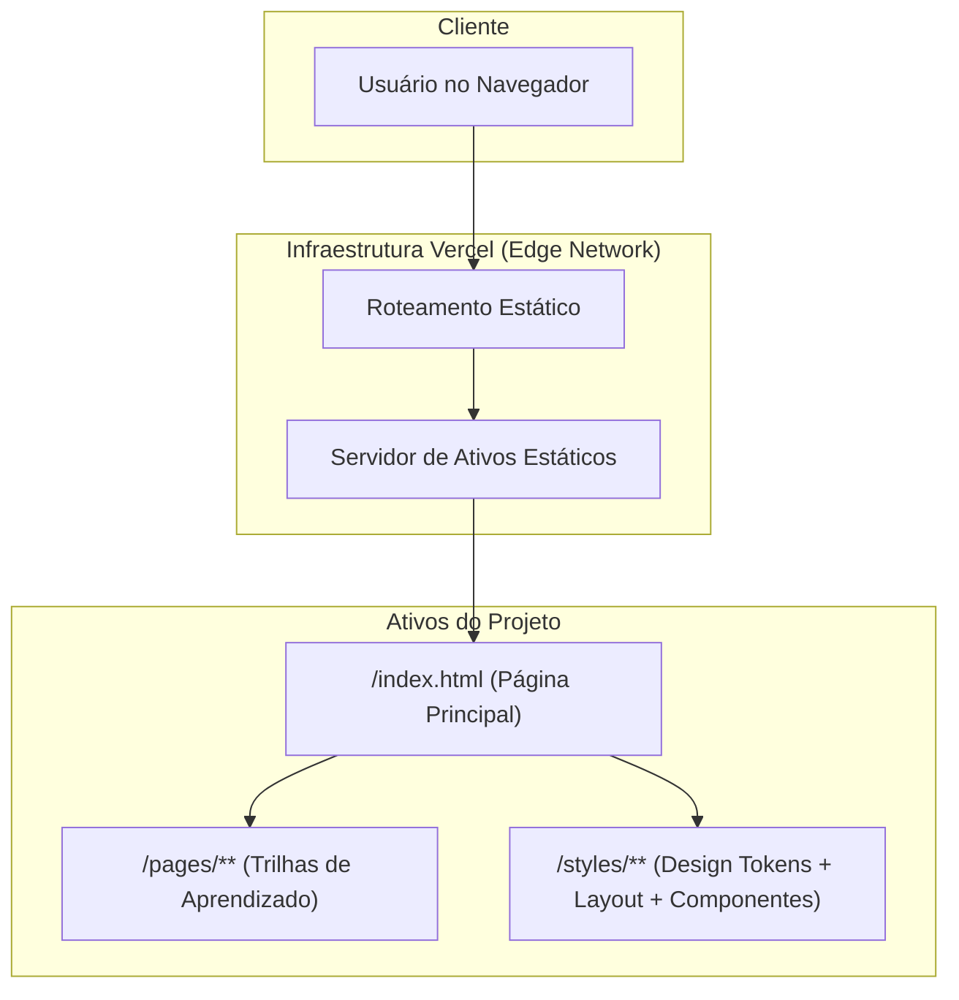

# Brain Developer: Plataforma Educacional para Carreiras em Programação

**Navegue pelo universo do desenvolvimento de software com clareza e propósito.**

<p align="center">
  <a href="https://braindeveloper.vercel.app/" target="_blank" rel="noopener noreferrer">
    
  </a>
</p>

---

## Abstract (Resumo Técnico)

O projeto **Brain Developer** é uma iniciativa web concebida para mitigar a complexidade inerente à escolha e progressão de uma carreira no desenvolvimento de software. Em um cenário digital em constante evolução, a abundância de tecnologias e caminhos pode ser avassaladora para novatos e até mesmo para profissionais experientes que buscam transição ou aprofundamento. Este projeto aborda diretamente a lacuna de um guia estruturado e acessível, oferecendo roteiros claros para as trilhas de `Início na Programação`, `Desenvolvimento Front-End` e `Desenvolvimento Back-End`.

A solução proposta materializa-se como uma aplicação web estática, implementada primariamente com HTML5 e CSS3, garantindo alta performance, acessibilidade universal e facilidade de implantação. A metodologia empregada foca na curadoria e organização de informações essenciais, apresentando conceitos fundamentais, tecnologias chave e roadmaps de aprendizado de forma didática e visualmente engajadora. Os resultados esperados e alcançados incluem a democratização do acesso a informações de carreira em TI, a redução da barreira de entrada para aspirantes a desenvolvedores e a otimização do processo de autoaprendizagem. A principal contribuição do Brain Developer reside em sua capacidade de transformar um vasto e disperso corpo de conhecimento em um caminho de aprendizado coeso e direcionado, servindo como um ponto de partida robusto para qualquer indivíduo interessado em forjar uma carreira em programação.

## Badges Abrangentes

[](https://github.com/ESousa97/Brain-Developer/blob/main/LICENSE)
[](https://github.com/ESousa97/Brain-Developer)
[](https://github.com/ESousa97/Brain-Developer/commits/main)
[](https://github.com/ESousa97/Brain-Developer/issues)
[](https://github.com/ESousa97/Brain-Developer/pulls)
[](https://github.com/ESousa97/Brain-Developer)
[](https://github.com/ESousa97/Brain-Developer/graphs/contributors)
[](https://github.com/ESousa97/Brain-Developer/actions/workflows/ci.yml)
[](https://github.com/ESousa97/Brain-Developer/actions/workflows/codeql.yml)
[](https://www.codefactor.io/repository/github/ESousa97/Brain-Developer)

## Sumário

- [Introdução e Motivação](#introdução-e-motivação)
- [🔗 Link Principal / Acesso ao Projeto](#-link-principal--acesso-ao-projeto)
- [Arquitetura do Sistema](#arquitetura-do-sistema)
- [Diagrama de Arquitetura](#diagrama-de-arquitetura)
- [Decisões de Design Chave](#decisões-de-design-chave)
- [✨ Funcionalidades Detalhadas (com Casos de Uso)](#-funcionalidades-detalhadas-com-casos-de-uso)
- [🛠️ Tech Stack Detalhado](#%EF%B8%8F-tech-stack-detalhado)
- [📂 Estrutura Detalhada do Código-Fonte](#-estrutura-detalhada-do-código-fonte)
- [📋 Pré-requisitos Avançados](#-pré-requisitos-avançados)
- [🚀 Guia de Instalação e Configuração Avançada](#-guia-de-instalação-e-configuração-avançada)
- [⚙️ Uso Avançado e Exemplos](#%EF%B8%8F-uso-avançado-e-exemplos)
- [🧪 Estratégia de Testes e Qualidade de Código](#-estratégia-de-testes-e-qualidade-de-código)
- [🚢 Deployment Detalhado e Escalabilidade](#-deployment-detalhado-e-escalabilidade)
- [📜 Licença e Aspectos Legais](#-licença-e-aspectos-legais)
- [❓ FAQ (Perguntas Frequentes)](#-faq-perguntas-frequentes)
- [📞 Contato e Suporte](#-contato-e-suporte)

---

## Introdução e Motivação

A transição para uma carreira em desenvolvimento de software, ou a especialização em uma área específica, é frequentemente marcada por um volume massivo de informações, recursos dispersos e a ausência de um roteiro claro. Este cenário pode levar à paralisia por análise, desmotivação e, em última instância, ao abandono de um potencial caminho profissional promissor. A internet, embora rica em conteúdo, carece de plataformas que consolidem e estruturem o conhecimento de forma pedagógica, guiando o indivíduo desde os fundamentos até as nuances de especializações como Front-End e Back-End.

O projeto **Brain Developer** surge como uma resposta direta a essa problemática. Sua proposta de valor única reside na curadoria e organização estratégica de informações sobre trilhas de desenvolvimento, apresentando-as em um formato acessível e engajador. Diferente de plataformas de cursos genéricas ou blogs com conteúdo fragmentado, o Brain Developer oferece uma visão holística e interconectada das competências e tecnologias necessárias para cada jornada.

A motivação central para o desenvolvimento do Brain Developer é empoderar indivíduos a traçarem seu próprio caminho na programação com confiança e clareza. Objetiva-se não apenas fornecer conhecimento, mas também inspirar e orientar, facilitando a tomada de decisões informadas sobre quais tecnologias aprender e em que ordem. O impacto desejado é criar uma ferramenta de referência que acelere o aprendizado, promova a autossuficiência e contribua para a formação de uma força de trabalho tecnológica mais capacitada e direcionada.

## 🔗 Link Principal / Acesso ao Projeto

Acesse a demonstração interativa do projeto Brain Developer e explore os caminhos de aprendizado diretamente em seu navegador:

[🚀 Acesse o Brain Developer Online](https://braindeveloper.vercel.app)

Este link oferece acesso à versão mais recente do projeto, permitindo que você navegue pelas diferentes seções e compreenda a proposta e as funcionalidades do guia.

## Arquitetura do Sistema

O Brain Developer é concebido como uma **aplicação web estática**, o que implica uma arquitetura intrinsecamente simples, focada na entrega eficiente de conteúdo ao cliente. Esta escolha arquitetural é deliberada e justificada pela natureza do projeto: ser um guia informativo e não uma aplicação transacional ou interativa complexa.

### Componentes Arquiteturais

Os componentes principais do sistema são os arquivos HTML e CSS, que formam a interface do usuário e o conteúdo informativo. Não há um servidor de aplicação no lado do backend processando requisições dinâmicas ou um banco de dados persistindo informações.

1.  **`index.html` (Página Principal):** Serve como o ponto de entrada da aplicação. Apresenta uma visão geral do projeto e atua como hub de navegação para as trilhas de aprendizado.
2.  **`pages/` (Diretório de Páginas de Conteúdo):** Contém subdiretórios para cada trilha de aprendizado, encapsulando o conteúdo específico:
    - **`pages/Start/Start.html`:** Conteúdo para iniciantes absolutos.
    - **`pages/Front-End/Front-End.html`:** Conteúdo detalhado sobre desenvolvimento Front-End.
    - **`pages/Back-End/Back-End.html`:** Conteúdo detalhado sobre desenvolvimento Back-End.
    - **`pages/Full-Stack/Full-Stack.html`:** Conteúdo detalhado sobre desenvolvimento Full-Stack.
3.  **`styles/` (Design System Modular):** Tokens e estilos base compartilhados, além de estilos específicos por página em `styles/pages/`.

### Interações e Fluxo de Dados

O fluxo de dados e controle é puramente baseado na navegação do lado do cliente:

- O usuário acessa `index.html`.
- Através de links HTML, o usuário navega para as páginas de trilha (`Start.html`, `Front-End.html`, `Back-End.html`).
- Cada página carrega seus próprios estilos CSS e recursos (imagens/ícones) conforme necessário.
- Não há chamadas a APIs externas para dados dinâmicos, nem processamento de formulários ou autenticação.

### Diagrama de Arquitetura



### Justificativas das Decisões Arquiteturais

A escolha de uma arquitetura estática para o Brain Developer foi motivada por diversos fatores estratégicos:

- **Simplicidade e Manutenibilidade:** A ausência de um backend complexo reduz drasticamente a superfície de ataque, os custos de manutenção e a complexidade do desenvolvimento. Isso permite que o foco principal seja na qualidade e curadoria do conteúdo.
- **Performance:** Páginas estáticas são entregues diretamente por CDNs (Content Delivery Networks), resultando em tempos de carregamento extremamente rápidos e uma experiência de usuário fluida. Não há latência de processamento de servidor ou consultas a banco de dados.
- **Custo-Benefício:** O deploy de sites estáticos é notavelmente econômico, muitas vezes gratuito para projetos de pequeno a médio porte, como o Brain Developer, em plataformas como Vercel.
- **Segurança:** Com a ausência de lógica de servidor e bancos de dados, a superfície para vulnerabilidades de segurança é minimizada, tornando o projeto inerentemente mais seguro contra ataques comuns a aplicações web dinâmicas.
- **Acessibilidade e Compatibilidade:** O uso de HTML e CSS padrão garante ampla compatibilidade com diversos navegadores e dispositivos, além de ser fundamental para a acessibilidade.

Esta arquitetura é a mais adequada para um projeto cujo objetivo primordial é a entrega eficiente e escalável de informações estáticas e bem formatadas.

## Decisões de Design Chave

As decisões de design do Brain Developer foram orientadas pela clareza, usabilidade e uma experiência visualmente atraente, mantendo a leveza e a performance de um site estático.

- **Uso de HTML5 e CSS3 Puros:** A escolha por HTML5 para a estruturação do conteúdo e CSS3 para a estilização, sem a dependência de grandes frameworks JavaScript, garante leveza, tempos de carregamento rápidos e máxima compatibilidade. Isso também facilita a compreensão do código-fonte para novos contribuidores.
- **Design Responsivo (Mobile-First Implícito):** Embora não explicitamente declarado como mobile-first em todos os CSS, a presença de meta tags de `viewport` e o uso extensivo de media queries demonstram um compromisso com a adaptabilidade a diferentes tamanhos de tela. Isso é crucial para a acessibilidade e usabilidade em dispositivos móveis, onde muitos usuários podem acessar o conteúdo.
- **Estilos In-line e Separados por Página:** A estratégia de incluir blocos `<style>` diretamente nos arquivos HTML das páginas, além de arquivos CSS externos específicos, permite uma modularidade temática. Cada página de trilha pode ter sua própria paleta de cores e animações, reforçando a identidade visual daquele caminho específico, enquanto `styles.css` mantém a consistência global.
- **Tipografia e Iconografia:**
    - **Google Fonts (Inter):** A fonte 'Inter' foi selecionada por sua legibilidade moderna e versatilidade em diferentes pesos, contribuindo para uma experiência de leitura confortável.
    - **Font Awesome:** A integração de ícones da biblioteca Font Awesome enriquece a interface, fornecendo elementos visuais intuitivos que complementam o texto e guiam o usuário.
- **Animações e Efeitos Visuais:** Animações sutis (`slideInDown`, `fadeIn`, `float` para backgrounds) e efeitos de hover são empregados para tornar a interface mais dinâmica e engajadora, sem comprometer a performance. Isso adiciona um toque de modernidade e interatividade a uma aplicação estática.
- **Paletas de Cores Temáticas:** A definição de variáveis CSS (`--primary-color`, `--secondary-color`, `--bg-gradient`, etc.) em `:root` e a variação dessas variáveis entre as páginas permitem a criação de paletas de cores distintas para cada trilha. Isso ajuda a diferenciar visualmente as seções e a criar uma identidade para cada caminho de aprendizado.

Essas decisões de design visam criar uma experiência de usuário intuitiva, visualmente agradável e performática, que serve efetivamente ao propósito educacional do Brain Developer.

## ✨ Funcionalidades Detalhadas (com Casos de Uso)

O Brain Developer, apesar de ser uma aplicação estática, oferece funcionalidades claras e bem definidas, centradas na entrega eficiente e estruturada de informações.

### 1. Página Principal (Home - `index.html`)

- **Propósito:** Servir como o ponto de entrada e o hub central de navegação do projeto. Apresenta a essência do Brain Developer e convida o usuário a explorar as diferentes trilhas de carreira.
- **Funcionalidades:**
    - **Título e Subtítulo Impactantes:** Apresenta o nome do projeto e seu slogan filosófico ("Seu Caminho na Programação"), estabelecendo o tom e o propósito.
    - **Cartões de Navegação Interativos:** Exibe três cartões distintos ("Início na Programação", "Desenvolvedor Front-End", "Desenvolvedor Back-End"), cada um com um ícone, título, breve descrição e um botão de "Explorar".
    - **Efeitos Visuais e Animações:** Utiliza animações CSS para introdução de elementos e efeitos de hover nos cartões para indicar interatividade e engajamento.
- **Casos de Uso:**
    - **Usuário Iniciante:** Um indivíduo sem experiência em programação acessa a página, sente-se acolhido pelo slogan e clica em "Explorar" no cartão "Início na Programação" para entender os fundamentos.
    - **Profissional em Transição:** Um desenvolvedor de outra área busca se especializar em Front-End, acessa a página e clica no cartão "Desenvolvedor Front-End" para ver o roadmap.
    - **Exploração Geral:** Um usuário curioso navega pela página principal para ter uma visão rápida das áreas abordadas pelo Brain Developer.

### 2. Página "Início na Programação" (`pages/Start/Start.html`)

- **Propósito:** Fornecer um guia fundamental para aqueles que estão começando do zero no mundo da programação, cobrindo conceitos básicos e ferramentas essenciais.
- **Funcionalidades:**
    - **Seções de Conteúdo Estruturadas:** Apresenta informações em seções como "Lógica de Programação e Algoritmos", "Estruturas de Dados", "Controle de Versão (Git e GitHub)", "HTML, CSS e JavaScript Fundamentais", "Ferramentas e Ambientes de Desenvolvimento" e "Comunidade e Recursos".
    - **Descrições Claras e Listas:** Cada seção detalha o tópico com parágrafos explicativos e listas de bullet points para facilitar a leitura e absorção.
    - **Links para Recursos Externos:** Direcionamento para recursos de aprendizado externos para cada tópico.
- **Casos de Uso:**
    - **Primeiro Contato com Programação:** Um estudante que nunca programou acessa esta página para entender o que é lógica de programação e por que Git é importante.
    - **Reforço de Fundamentos:** Alguém que parou de programar há muito tempo revisita esta seção para relembrar os conceitos básicos antes de avançar para áreas mais específicas.

### 3. Página "Desenvolvedor Front-End" (`pages/Front-End/Front-End.html`)

- **Propósito:** Oferecer um roadmap detalhado e abrangente para se tornar um desenvolvedor Front-End, abordando as tecnologias e habilidades cruciais.
- **Funcionalidades:**
    - **Visão Geral do Front-End:** Introdução à área, seu papel e importância.
    - **Seções de Habilidades Essenciais:** Detalha HTML, CSS e JavaScript como pilares, com exemplos de uso e a importância de cada.
    - **Exploração de Frameworks e Bibliotecas:** Apresenta os principais frameworks (React, Angular, Vue), suas características e quando usá-los.
    - **Ferramentas e Ecossistema:** Aborda ferramentas de build, controle de versão e conceitos como design responsivo, performance e acessibilidade.
    - **Estrutura de Habilidades com Níveis:** Utiliza cartões de habilidades com rótulos de nível (Essencial, Importante, Avançado) para guiar o aprendizado progressivo.
- **Casos de Uso:**
    - **Aspirante a Front-End:** Um designer gráfico que quer migrar para desenvolvimento web acessa esta página para entender o caminho e as tecnologias que precisa dominar.
    - **Desenvolvedor Full-Stack:** Um profissional de Back-End busca aprofundar seus conhecimentos em Front-End e usa esta página para identificar lacunas e priorizar o aprendizado de frameworks.

### 4. Página "Desenvolvedor Back-End" (`pages/Back-End/Back-End.html`)

- **Propósito:** Guiar o usuário através do ecossistema de desenvolvimento Back-End, desde os fundamentos até conceitos avançados de arquitetura e infraestrutura.
- **Funcionalidades:**
    - **Introdução ao Back-End:** Explica o papel do Back-End, sua importância e as responsabilidades de um desenvolvedor nessa área.
    - **Fundamentos de Banco de Dados:** Aborda SQL e NoSQL, suas diferenças, casos de uso e exemplos de tecnologias.
    - **APIs e Comunicação:** Detalha REST e GraphQL, métodos HTTP e a importância da comunicação entre sistemas.
    - **Linguagens de Programação:** Apresenta as linguagens mais relevantes para Back-End e seus respectivos frameworks.
    - **Conceitos Avançados:** Explora tópicos como autenticação/autorização, caching, filas de mensagens, microserviços, serverless e DevOps.
    - **Cartões de Fundamentos:** Utiliza cartões estilizados para apresentar conceitos chave, cada um com um ícone ilustrativo.
- **Casos de Uso:**
    - **Aspirante a Back-End:** Um estudante de ciência da computação quer focar em Back-End e usa esta página para planejar seus estudos em bancos de dados e linguagens de servidor.
    - **Desenvolvedor Front-End:** Um profissional de Front-End busca entender melhor como o Back-End funciona para melhorar a comunicação com equipes de servidor ou para transitar de carreira.

Em resumo, as funcionalidades do Brain Developer são projetadas para oferecer uma experiência de aprendizado clara, organizada e visualmente atraente, transformando a complexidade do aprendizado de programação em um caminho navegável e inspirador.

## 🛠️ Tech Stack Detalhado

O Brain Developer é uma aplicação web estática, focada na entrega de conteúdo. A sua "pilha tecnológica" é, portanto, otimizada para performance e simplicidade no lado do cliente e na implantação.

| Categoria              | Tecnologia               | Versão Específica | Propósito no Projeto                                                         | Justificativa da Escolha                                                                      |
| ---------------------- | ------------------------ | ----------------- | ---------------------------------------------------------------------------- | --------------------------------------------------------------------------------------------- |
| **Frontend**           | **HTML5**                | N/A               | Estruturação semântica do conteúdo educacional e navegação entre trilhas     | Padrão universal para web, essencial para acessibilidade, SEO e compatibilidade cross-browser |
| **Estilização**        | **CSS3**                 | N/A               | Design moderno, animações, responsividade e identidade visual de cada trilha | Poder nativo para criar interfaces educacionais modernas sem dependências externas            |
| **Tipografia**         | **Google Fonts (Inter)** | Latest            | Tipografia moderna e legível para conteúdo educacional                       | Fonte versátil com excelente legibilidade em diferentes pesos e tamanhos                      |
| **Iconografia**        | **Font Awesome**         | 6.0.0             | Ícones visuais para reforço de conceitos e navegação intuitiva               | Biblioteca robusta com ícones representativos para tecnologias e conceitos de programação     |
| **Deploy**             | **Vercel**               | N/A               | Hospedagem, CI/CD automático e distribuição global via CDN                   | Integração perfeita com GitHub, deployments automáticos e performance otimizada               |
| **Controle de Versão** | **Git & GitHub**         | N/A               | Gerenciamento de código-fonte, versionamento e colaboração                   | Padrão da indústria para desenvolvimento colaborativo e controle de mudanças                  |
| **Assets**             | **Imagens/Ícones**       | N/A               | Recursos visuais para reforço de conceitos de programação                    | Suporte visual essencial para compreensão de tecnologias e ferramentas abstratas              |

### Arquitetura Tecnológica Justificada

**Stack "Vanilla" (HTML/CSS Puros):** Decisão estratégica de não utilizar frameworks JavaScript para manter o código enxuto, desempenho otimizado e foco total na qualidade da apresentação educacional do conteúdo de programação.

## 📂 Estrutura Detalhada do Código-Fonte

```
Brain-Developer/
├── 📄 index.html                    # Página principal e hub de navegação
├── 📁 pages/                        # Páginas das trilhas de aprendizado
│   ├── 🚀 Start/
│   │   └── Start.html               # Guia completo para iniciantes
│   ├── 🎨 Front-End/
│   │   └── Front-End.html           # Guia Front-End Developer
│   ├── ⚙️ Back-End/
│   │   └── Back-End.html            # Guia Back-End Developer
│   └── 🧩 Full-Stack/
│       └── Full-Stack.html          # Guia Full-Stack Developer
├── 🎨 styles/                       # Design system modular
│   ├── tokens.css                   # Tokens de design
│   ├── base.css                     # Estilos base
│   ├── layout.css                   # Layouts e grids
│   ├── components.css               # Componentes reutilizáveis
│   ├── utilities.css                # Utilitários
│   └── pages/                       # Estilos específicos por página
├── 📜 LICENSE                       # Licença MIT
└── 📚 README.md                     # Documentação completa do projeto
```

**Detalhamento dos Componentes:**

- **`index.html`:** Ponto de entrada principal com estrutura HTML semântica e CSS crítico embutido para performance otimizada
- **`pages/`:** Diretório contendo as trilhas educacionais específicas, cada uma com conteúdo curado
- **`styles/`:** Design system modular com tokens, base, layout, componentes e estilos por página

### Sistema de Design Modular

O design system é centralizado em `styles/tokens.css` e reaproveitado em `styles/base.css`, `styles/layout.css`, `styles/components.css`, `styles/utilities.css` e nos estilos específicos de cada trilha em `styles/pages/`.

````

## 📋 Pré-requisitos Avançados

Para clonar e executar o projeto Brain Developer localmente, você precisará dos seguintes softwares e ferramentas:

**Para Usuários Finais:**
*   **Navegador Web Moderno:** Qualquer navegador atual (Google Chrome, Mozilla Firefox, Microsoft Edge, Safari) é compatível.
    *   Versão Mínima Recomendada: As versões mais recentes para garantir suporte total a CSS3 e performance.

**Para Desenvolvimento:**
*   **Git:** Ferramenta de controle de versão para clonar o repositório.
    *   Versão Mínima Recomendada: 2.x
    *   [Download Git](https://git-scm.com/downloads)
*   **Editor de Código / IDE:** Um editor de texto com destaque de sintaxe para HTML e CSS é altamente recomendado para qualquer modificação ou exploração do código.
    *   Exemplos: Visual Studio Code, Sublime Text, Atom.
*   **Servidor Local (Opcional):** Para desenvolvimento com Live Reload
    *   Python HTTP Server, Node.js serve, ou VS Code Live Server Extension

Não há dependências de backend, bancos de dados ou runtimes de linguagem específicos (como Node.js, Python, Java) para a execução do projeto, uma vez que se trata de uma aplicação puramente estática.

## 🚀 Guia de Instalação e Configuração Avançada

A instalação e configuração do Brain Developer para execução local é um processo direto, dada a natureza estática do projeto.

### Instalação Básica

1.  **Clonar o Repositório:**
    Abra seu terminal ou prompt de comando e execute o seguinte comando para clonar o repositório do projeto para sua máquina local:

    ```bash
    git clone https://github.com/ESousa97/Brain-Developer.git
    ```

2.  **Navegar até o Diretório do Projeto:**
    Após a clonagem, entre no diretório principal do projeto:

    ```bash
    cd Brain-Developer
    ```

3.  **Executar a Aplicação:**
    Como o Brain Developer é um site estático, não há um processo de compilação ou um servidor de desenvolvimento complexo para iniciar. Você pode simplesmente abrir o arquivo `index.html` diretamente em seu navegador web.

    *   **No Windows:**
        ```bash
        start index.html
        ```
    *   **No macOS:**
        ```bash
        open index.html
        ```
    *   **No Linux:**
        ```bash
        xdg-open index.html
        ```

### Configuração de Servidor Local (Recomendado)

Para simular um ambiente de servidor web local (útil para testar caminhos relativos de forma mais robusta):

```bash
# Com Python 3
python -m http.server 8000

# Com Node.js
npx serve .

# Com VS Code Live Server
# Clique com botão direito em index.html > "Open with Live Server"
````

Depois, abra seu navegador e acesse `http://localhost:8000`.

**Configuração de Ambiente:**
Não são necessárias variáveis de ambiente ou arquivos de configuração (`.env`) para a execução básica do Brain Developer, pois ele não interage com serviços de backend ou APIs externas que exijam chaves de acesso.

## ⚙️ Uso Avançado e Exemplos

O Brain Developer é projetado para ser um guia intuitivo, e seu uso principal envolve a navegação pelos caminhos de aprendizado. No entanto, algumas dicas podem aprimorar a exploração do conteúdo:

### Navegação Estratégica

1.  **Navegação Direta para Seções Específicas:**
    Embora a página principal ofereça links claros, você pode acessar diretamente as trilhas de interesse:
    - **Início na Programação:** `https://braindeveloper.vercel.app/pages/Start/Start.html`
    - **Desenvolvedor Front-End:** `https://braindeveloper.vercel.app/pages/Front-End/Front-End.html`
    - **Desenvolvedor Back-End:** `https://braindeveloper.vercel.app/pages/Back-End/Back-End.html`

2.  **Exploração do Design Responsivo:**
    Para desenvolvedores e designers, é altamente recomendado testar a responsividade do site. Abra o Brain Developer em seu navegador e redimensione a janela ou use as ferramentas de desenvolvedor (Ctrl+Shift+I no Chrome/Firefox, e ative o "Modo Dispositivo") para simular diferentes tamanhos de tela.

3.  **Inspeção do Código-Fonte (Ferramentas de Desenvolvedor):**
    Para entender as decisões de design e estilização, utilize as ferramentas de desenvolvedor do seu navegador (F12). Explore as abas "Elements" e "Styles" para ver como o HTML é estruturado e como as regras CSS são aplicadas.

### Customização Avançada

**Personalização de Cores Temáticas:**

```css
/* Personalizar paleta de cores */
:root {
    --primary-color: #667eea;
    --secondary-color: #764ba2;
    --accent-color: #f093fb;
    --bg-gradient: linear-gradient(135deg, #667eea 0%, #764ba2 100%);
}

/* Modificar animações de cards */
.nav-card:hover {
    transform: translateY(-10px) scale(1.02);
    box-shadow: 0 30px 60px rgba(0, 0, 0, 0.15);
}
```

**Adição de Novo Conteúdo:**

```html
<!-- Estrutura para nova seção educacional -->
<section class="content-section fade-in">
    <div class="section-header">
        <h2 class="section-title">🎯 Nova Trilha</h2>
        <p class="section-description">Descrição da nova trilha...</p>
    </div>
</section>
```

4.  **Uso como Recurso de Estudo Offline:**
    Após clonar o repositório, o projeto pode ser acessado completamente offline. Isso permite que você estude e revise os roadmaps e conceitos sem a necessidade de uma conexão com a internet.

## 🧪 Estratégia de Testes e Qualidade de Código

Dada a natureza de aplicação web estática do Brain Developer, a estratégia de testes e qualidade de código é focada na **integridade visual, funcionalidade de navegação e compatibilidade**.

### Tipos de Testes Implementados

1.  **Testes Visuais e de Responsividade:**
    - **Propósito:** Garantir que o layout e a estilização das páginas se apresentem corretamente em diferentes navegadores e tamanhos de tela.
    - **Ferramentas/Abordagem:** Testes manuais em diversos navegadores e o uso das ferramentas de desenvolvedor do navegador (modo de dispositivo) para simular diferentes viewports.
    - **Foco:** Alinhamento de elementos, quebras de linha, cores, fontes, espaçamentos, e como as animações e transições se comportam.

2.  **Testes de Navegação e Integridade de Links:**
    - **Propósito:** Assegurar que todos os links internos funcionam corretamente, direcionando o usuário para as páginas esperadas sem erros 404.
    - **Ferramentas/Abordagem:** Teste manual de cliques em todos os botões e links.
    - **Foco:** Consistência dos caminhos de arquivo e URLs relativas.

3.  **Validação de HTML e CSS:**
    - **Propósito:** Verificar a conformidade do código com os padrões HTML5 e CSS3, identificando erros de sintaxe ou práticas não recomendadas.
    - **Ferramentas/Abordagem:** Validadores online (W3C Markup Validation Service, W3C CSS Validation Service).
    - **Foco:** Semântica HTML, uso correto de tags, regras CSS válidas e otimizadas.

4.  **Testes de Acessibilidade:**
    - **Propósito:** Garantir que o conteúdo seja acessível a usuários com deficiência, seguindo as diretrizes WCAG.
    - **Ferramentas/Abordagem:** Ferramentas de auditoria de acessibilidade embutidas em navegadores (Lighthouse no Chrome).
    - **Foco:** Contraste de cores, uso de atributos `alt` em imagens, estrutura de cabeçalhos, navegação por teclado.

### Qualidade de Código e CI/CD

- **Convenções de Código:** A qualidade do código é mantida através da aderência a convenções de nomenclatura e formatação para HTML e CSS. A consistência visual no código é incentivada.
- **Integração Contínua/Entrega Contínua (CI/CD):** O projeto utiliza o **Vercel** para implantação:
    - Qualquer `push` para o branch principal aciona automaticamente um novo build e deploy do site.
    - Isso garante que a versão online esteja sempre sincronizada com o código-fonte mais recente.
    - Para Pull Requests, o Vercel gera automaticamente uma URL de pré-visualização, permitindo que as alterações sejam revisadas em um ambiente de staging.

## 🚢 Deployment Detalhado e Escalabilidade

O Brain Developer, sendo uma aplicação web estática, beneficia-se de um processo de deployment e uma arquitetura de escalabilidade intrinsecamente eficientes.

### Plataforma de Deployment

O projeto é implantado na plataforma **Vercel**. A Vercel é uma plataforma de desenvolvimento e implantação baseada em nuvem, otimizada para sites estáticos e aplicações Jamstack (JavaScript, APIs, Markup).

- **Link do Projeto Implantado:** [https://braindeveloper.vercel.app](https://braindeveloper.vercel.app)

### Processo de Deployment

O processo de deployment com Vercel é altamente automatizado e integrado ao fluxo de trabalho de desenvolvimento baseado em Git:

1.  **Conexão com o Repositório Git:** O projeto Brain Developer está conectado ao seu repositório GitHub (`https://github.com/ESousa97/Brain-Developer`).
2.  **Deployment Contínuo:**
    - A cada `push` para o branch `main`, a Vercel detecta as alterações.
    - Ela então inicia um novo processo de build (para projetos estáticos, é geralmente apenas a cópia dos arquivos).
    - Os arquivos são implantados em sua CDN global (Content Delivery Network).
    - A URL de produção é automaticamente atualizada para apontar para a nova versão.
3.  **Deployments de Pré-visualização:**
    - Para cada Pull Request aberto no GitHub, a Vercel cria automaticamente uma URL de pré-visualização única.
    - Isso permite que colaboradores e revisores visualizem as mudanças propostas em um ambiente isolado antes que sejam mescladas ao branch principal.

### Escalabilidade

A arquitetura estática do Brain Developer, combinada com a plataforma Vercel, oferece um modelo de escalabilidade altamente eficaz:

- **Escalabilidade Horizontal Intrínseca:** Sites estáticos são inerentemente escaláveis. Uma vez que os arquivos HTML, CSS e imagens são gerados, eles podem ser servidos por qualquer servidor web.
- **Content Delivery Network (CDN):** A Vercel distribui os ativos do Brain Developer globalmente através de sua CDN. Isso significa que os usuários acessam o conteúdo do servidor mais próximo a eles, reduzindo a latência e melhorando a velocidade de carregamento.
- **Baixo Custo e Alta Disponibilidade:** A natureza estática e o uso de CDN resultam em custos operacionais mínimos e alta disponibilidade.
- **Monitoramento e Logging:** A Vercel oferece painéis básicos de monitoramento de tráfego e logs de acesso, suficientes para um projeto estático como o Brain Developer.

## 📜 Licença e Aspectos Legais

O projeto **Brain Developer** é distribuído sob a licença **MIT License**.

A Licença MIT é uma licença de software livre permissiva que impõe requisitos mínimos sobre como o software pode ser usado e redistribuído. Ela permite que o software seja reutilizado em software proprietário, desde que todos os exemplares do software incluam uma cópia dos termos da licença MIT e o aviso de direitos autorais.

### Principais Implicações da Licença MIT:

- **Uso Livre:** Você é livre para usar, copiar, modificar, mesclar, publicar, distribuir, sublicenciar e/ou vender cópias do software.
- **Sem Garantia:** O software é fornecido "como está", sem garantia de qualquer tipo, expressa ou implícita.
- **Atribuição Obrigatória:** Você deve incluir o aviso de direitos autorais e a permissão da licença em todas as cópias ou partes substanciais do software.

Para o texto completo da licença, consulte o arquivo `LICENSE` no repositório:

[Visualizar Licença MIT](https://github.com/ESousa97/Brain-Developer/blob/main/LICENSE)

Esta escolha de licença reflete o compromisso do projeto com a abertura e a colaboração, incentivando a comunidade a utilizar, aprender e contribuir sem grandes restrições.

## ❓ FAQ (Perguntas Frequentes)

**P: O que é o Brain Developer?**
**R:** O Brain Developer é um guia e roteiro de carreira para aspirantes e profissionais de desenvolvimento de software. Ele oferece caminhos estruturados para "Início na Programação", "Desenvolvimento Front-End" e "Desenvolvimento Back-End", detalhando conceitos, tecnologias e habilidades essenciais.

**P: O Brain Developer é um curso ou uma plataforma de aprendizado?**
**R:** Não, o Brain Developer não é um curso nem uma plataforma de aprendizado interativa com aulas ou exercícios. Ele funciona como um **guia de referência e um roadmap**, fornecendo uma estrutura clara sobre o que aprender em cada área e a ordem recomendada para o aprendizado.

**P: Preciso pagar para usar o Brain Developer?**
**R:** Não, o Brain Developer é um projeto de código aberto e totalmente gratuito. Você pode acessá-lo online ou clonar o repositório para uso local sem custo algum.

**P: Quais tecnologias são necessárias para executar o projeto localmente?**
**R:** Apenas um navegador web moderno e o Git para clonar o repositório. O projeto é uma aplicação web estática (HTML/CSS), então não há necessidade de runtimes de linguagem, bancos de dados ou servidores complexos.

**P: Posso usar o conteúdo do Brain Developer para meus próprios projetos ou estudos?**
**R:** Sim, o projeto é distribuído sob a Licença MIT, que é permissiva. Você é livre para usar, copiar, modificar e distribuir o conteúdo, desde que mantenha o aviso de licença e direitos autorais.

**P: Existe um backend para o Brain Developer? Ele armazena dados de usuário?**
**R:** Não, o Brain Developer é uma aplicação puramente estática. Ele não possui um backend, não armazena dados de usuário e não utiliza cookies ou rastreadores de forma invasiva.

**P: Com que frequência o conteúdo é atualizado?**
**R:** O projeto é mantido ativamente e as atualizações de conteúdo são feitas periodicamente para refletir as mudanças e novas tendências no ecossistema de desenvolvimento de software. Fique atento aos commits no repositório GitHub.

**P: Por que não utilizar um framework como React ou Vue?**
**R:** Para conteúdo educacional estático, frameworks adicionariam complexidade desnecessária, impactando tempo de carregamento sem oferecer benefícios significativos. A abordagem HTML/CSS puro garante máxima performance e compatibilidade.

## 📞 Contato e Suporte

Para dúvidas, sugestões, relatórios de bugs ou para discutir o projeto Brain Developer, utilize os seguintes canais:

- **GitHub Issues:**
  Este é o canal preferencial para relatar bugs, solicitar novas funcionalidades ou iniciar discussões técnicas sobre o projeto.
    - [Abrir uma Nova Issue](https://github.com/ESousa97/Brain-Developer/issues)
    - [Ver Issues Existentes](https://github.com/ESousa97/Brain-Developer/issues)

- **Pull Requests (PRs):**
  Se você já implementou uma melhoria ou correção, envie um Pull Request para revisão.
    - [Ver Pull Requests Abertos](https://github.com/ESousa97/Brain-Developer/pulls)

- **Contato Direto (Autor Principal):**
  Para contato profissional ou perguntas mais específicas, você pode se conectar via LinkedIn.
    - **GitHub:** [@ESousa97](https://github.com/ESousa97)
    - **LinkedIn:** [José Enoque Sousa](https://www.linkedin.com/in/enoque-sousa-bb89aa168/)
    - **Demo Online:** [braindeveloper.vercel.app](https://braindeveloper.vercel.app/)

---

<p align="center">
  
  
</p>

<p align="center">
  <em>Desenvolvido com ❤️ por José Enoque - Democratizando o conhecimento em programação através de design moderno e curadoria de qualidade</em>
</p>

Agradecemos o seu interesse no Brain Developer e estamos abertos a feedback e colaboração para tornar este recurso ainda mais valioso para a comunidade de desenvolvedores.

> ✨ **Criado em:** 15 de nov. de 2024 às 00:23 - Transformando vidas através da programação
